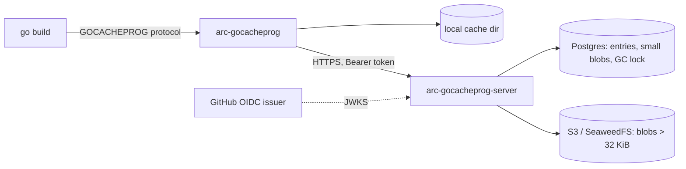

# arc-gocacheprog

A remote build cache for the Go toolchain. It has two binaries:

- `arc-gocacheprog` is a `GOCACHEPROG` program. The `go` command runs it as a subprocess and uses it to get and put build cache entries.
- `arc-gocacheprog-server` is an HTTP server that stores the entries. Metadata lives in Postgres. Blobs larger than 32 KiB go to S3 (SeaweedFS in production). Smaller blobs are stored inline in Postgres.

The client keeps a local on-disk cache and falls back to the server on a local miss. If the server is unreachable or auth fails, the build continues with the local cache only.

## How it works



HTTP API:

| Method and path | Purpose |
| --- | --- |
| `GET /v1/actions/{actionID}` | Fetch an entry and its blob. 404 on miss. |
| `PUT /v1/actions/{actionID}` | Store an entry and blob. |
| `POST /v1/actions/{actionID}/link` | Store an entry for a blob that is already readable by the caller. No body. 404 means the blob must be uploaded with `PUT`. |
| `GET /v1/whoami` | Show the identity the server derived from the token. |
| `GET /healthz` | Liveness. |

Blobs are content addressed by BLAKE3-256. Object keys are `<prefix><h[0:2]>/<h[2:4]>/<hash>`. Identical blobs are stored once per server, and the client asks for a link before uploading a blob it has already pushed elsewhere.

## Security model

- **Namespaces.** For GitHub Actions tokens the namespace is the `repository_id` claim. Entries in one namespace are never visible from another.
- **Scopes.** Like `actions/cache`, every entry is written to a scope. The write scope is the ref in the token (for example `refs/heads/feature`). A job can read its own ref, the PR base ref, and the configured `default_refs`. A job can never write to a scope other than its own ref.
- **PR isolation.** A pull request job writes only to its own ref (`refs/pull/N/merge`), which other branches cannot read. It reads the base branch and the default refs.
- **Event allowlist.** Only workflow events listed in `gha.write_events` may write (default: `push`, `pull_request`, `merge_group`, `workflow_dispatch`, `schedule`). Tokens from other events can read but not write. `pull_request_target`, `workflow_run` and `issue_comment` run with the default branch as ref while often building untrusted code, so they are read only.
- **Owner allowlist.** `allowed_owner_ids` (preferred, names can be re-registered), `allowed_owners` and `allowed_repositories` restrict which repositories can use the server. A config that allows no one is rejected unless `allow_any_owner: true` is set.
- **OutputID verification.** Go entries map an action ID to an output ID, which is the SHA-256 of the output file. The server hashes the uploaded body and rejects the upload if the SHA-256 does not match the claimed output ID. The client rechecks the SHA-256 of downloaded bodies before handing them to `go`.
- **BLAKE3 dedup.** The server computes the BLAKE3 hash of the uploaded body itself and does not trust the client's claim. Blobs are shared across namespaces on disk, but access goes through per-namespace references.
- **Link endpoint.** `POST .../link` succeeds only when the blob is already referenced by an entry in a scope the caller can read, and the size and SHA-256 match. A client cannot claim a blob it only knows the hash of, or one that belongs to another branch or repository.
- **Tokens.** OIDC ID tokens are verified against the issuer's JWKS, with the configured audience, RS256 only. Error responses do not include verification details. `ACTIONS_RUNTIME_TOKEN` is accepted only when `accept_runtime_token` is on, and its scopes come from the `ac` claim. Static keys are matched by SHA-256, so the config does not need to hold the plaintext key.

## GitHub Actions usage

```yaml
jobs:
  build:
    runs-on: ubuntu-latest
    permissions:
      contents: read
      id-token: write   # lets the client request an OIDC token
    env:
      GOCACHEPROG: arc-gocacheprog
      ARC_GOCACHE_URL: https://gocache.example.com
    steps:
      - uses: actions/checkout@v7
      - uses: actions/setup-go@v7
        with:
          go-version-file: go.mod
          cache: false
      - name: Install arc-gocacheprog
        run: go install github.com/gfx-labs/arc-gocacheprog/cmd/arc-gocacheprog@latest
      - run: go build ./...
      - run: go test ./...
```

The client binary is also in the server image at `/usr/local/bin/arc-gocacheprog`, so it can be copied out of `ghcr.io/gfx-labs/arc-gocacheprog`.

Client environment variables:

| Variable | Meaning |
| --- | --- |
| `ARC_GOCACHE_URL` | Server URL. Unset means local cache only. |
| `ARC_GOCACHE_AUTH` | `gha`, `gha-runtime`, `key` or `auto` (default). `auto` uses `gha` when `ACTIONS_ID_TOKEN_REQUEST_URL` is set, otherwise `key` if `ARC_GOCACHE_KEY` is set. |
| `ARC_GOCACHE_KEY` | Static key for `key` auth. |
| `ARC_GOCACHE_AUDIENCE` | OIDC audience (default `arc-gocacheprog`). Must match `gha.audience` on the server. |
| `ARC_GOCACHE_DIR` | Local cache dir (default `<user cache dir>/arc-gocacheprog`). |
| `ARC_GOCACHE_READONLY` | `1` disables uploads. |
| `ARC_GOCACHE_VERBOSE` | `1` logs a stats line and warnings, `2` logs debug. |

`arc-gocacheprog -whoami` prints the identity the server assigns to the current token.

## Local usage with a static key

Start the local stack (Postgres, SeaweedFS and the server, using `deploy/config.compose.yaml`):

```sh
docker compose -f deploy/docker-compose.yaml up --build
```

Then build with the key `dev-key`:

```sh
go install ./cmd/arc-gocacheprog
GOCACHEPROG=arc-gocacheprog \
ARC_GOCACHE_URL=http://localhost:8080 \
ARC_GOCACHE_KEY=dev-key \
ARC_GOCACHE_VERBOSE=1 \
go build ./...
```

The stats line on exit shows `local_hits`, `remote_hits`, `misses`, `uploads` and `linked`. Set `SERVER_PORT` or `SEAWEEDFS_S3_PORT` to change the host ports. The compose credentials are fixed and for local use only.

## Server configuration

Run the server with a YAML file:

```sh
arc-gocacheprog-server -config config.yaml
```

`ARC_GOCACHE_CONFIG` sets the default path. `${VAR}` references in the file are expanded from the environment. [deploy/config.example.yaml](deploy/config.example.yaml) lists every option with comments. Schema migrations run at startup.

Container image: `ghcr.io/gfx-labs/arc-gocacheprog`. The default command reads `/etc/arc-gocacheprog/config.yaml`. The image runs as a non-root user on distroless.

## Garbage collection

The server runs GC every `gc.interval` while `gc.enabled` is set. A Postgres lock keeps multiple replicas from running it at once. Each pass does the following:

- Deletes entries whose `accessed_at` is older than `gc.entry_ttl`. Access times are only rewritten when older than `storage.touch_interval`, so the TTL is loose by up to that interval.
- If `gc.namespace_max_bytes` is set, evicts the least recently used entries in each namespace that is over quota.
- Deletes blobs with no references once they have been unreferenced for `gc.blob_grace`. The grace period covers uploads that wrote the blob but have not yet written the entry.
- If `gc.orphan_sweep` is set, lists the bucket and deletes objects that have no blob row.

Run one pass and exit, for example from a CronJob:

```sh
arc-gocacheprog-server -config config.yaml -gc-once
```

## Tests

```sh
go vet ./...
go test ./...
```

The integration tests start Postgres with `embedded-postgres`, which downloads Postgres binaries on first run, and use `grafana/s3-mock` for S3.

## Layout

- `cmd/arc-gocacheprog`: GOCACHEPROG client.
- `cmd/arc-gocacheprog-server`: HTTP server.
- `internal/api`: HTTP contract shared by both.
- `internal/client`, `internal/server`: implementations.
- `integration`: end to end tests.
- `deploy`: example config and local compose stack.
